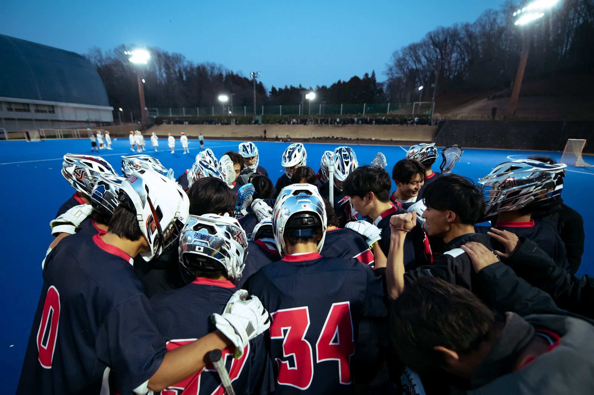

# 慶應義塾體育會ラクロス部 創部40周年記念寄付金 特設サイト

寄付金募集のランディングページ。ビルドツールは使っていないため、`index.html` をテキストエディタで開けばそのまま編集できる。

## ファイル構成

```
site/
├─ index.html          … ページ本体（HTML・CSS・JSすべてこの1ファイル）
├─ robots.txt
└─ assets/img/         … 写真（favicon.svg 以外は最適化スクリプトが生成）
```

## よくある更新

### 文言を直す

`index.html` の該当箇所を直接編集する。掲載原稿は `../HP用文章.md`。

### 募集開始日を入れる

`index.html` 内の `<span class="tbd">2026年◯月〇〇日</span>` を検索（**2箇所**：ヒーローと募集要項）。日付に置き換え、`<span class="tbd">` タグごと外す。

### 申込フォームのURLを入れる

申込ステップ2のボタンを次のように書き換える。

```html
<!-- 変更前 -->
<a class="btn btn-gold btn-block is-tbd" href="#apply" aria-disabled="true">申込フォーム（準備中）</a>

<!-- 変更後 -->
<a class="btn btn-gold btn-block btn-arrow" href="https://forms.office.com/…" target="_blank" rel="noopener">申込フォームへ進む</a>
```

### 写真を入れる・差し替える

1. `../images-src/` に規定のファイル名で写真を置く（一覧は `../制作メモ.md`）
2. `08_寄付金` フォルダで `python scripts/optimize_images.py` を実行
3. `index.html` のプレースホルダーを `<picture>` に差し替える

```html
<!-- 変更前（グレーの枠） -->
<span class="photo r-4x3" data-label="写真：男子部のプレー 主役（mens-01／横長 4:3）"></span>

<!-- 変更後 -->
<span class="photo r-4x3 is-filled">
  <picture>
    <source srcset="assets/img/mens-01.webp" type="image/webp">
    
  </picture>
</span>
```

ヒーローの画像だけは最初に表示されるので `loading="lazy"` を付けず、`fetchpriority="high"` を付ける。

### ロゴを差し替える

`../images-src/` の4点（40周年ロゴ 白／紺、男子、女子）を置き換えて `python scripts/optimize_images.py` を実行すると、WebP・PNG・favicon・OGP画像がまとめて作り直される。

**白ロゴは暗い面にだけ、紺ロゴは明るい面にだけ置く。** 女子部ロゴは白単色なので明るい面に置くと消える。

### 色を変える

`index.html` 冒頭の `:root` にすべての色が変数でまとまっている。紺は `#04023D` を基準に、同色相の5段（`--abyss` / `--ground` / `--navy` / `--navy-2` / `--navy-3`）で奥行きを出しているので、変えるときは段階の関係を保つ。

## 動作確認

```bash
# 08_寄付金 フォルダで
python -m http.server 8899 --directory site
# → http://localhost:8899 を開く
```

ヘッドレスブラウザで3つの画面幅を自動撮影して確認できる。横スクロールの有無とJSエラーも同時に報告する。

```bash
npm i playwright && npx playwright install chromium   # 初回のみ
node scripts/shoot.js 出力先フォルダ
```

確認する幅：390px（スマホ）／834px（タブレット）／1440px（PC）。横スクロールが出ないこと、申込ボタンが常に到達可能なことを見る。

## 公開

GitHub Pages で公開している。`main` ブランチに push すると自動で反映される（反映まで1〜2分）。

## 注意

- **振込口座の数字は絶対に推測で直さない。** 変更が必要な場合は原稿（`../HP用文章.md`）とKLBの確認を経てから反映する
- 部員の顔が写る写真の差し替えは、掲載可否を部内で確認してから行う

## 関連

- [[HP用文章]]（掲載原稿）
- [[制作メモ]]（決定事項・未確定事項・写真スロット一覧）
- [[Projects/マーケティング/CLAUDE|マーケティング CLAUDE.md]]
